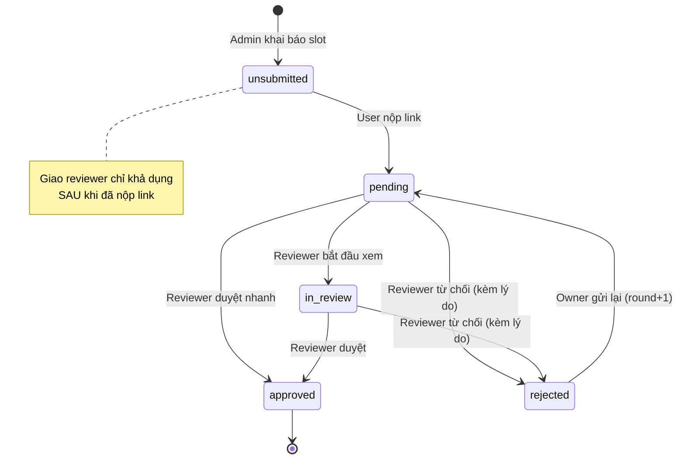
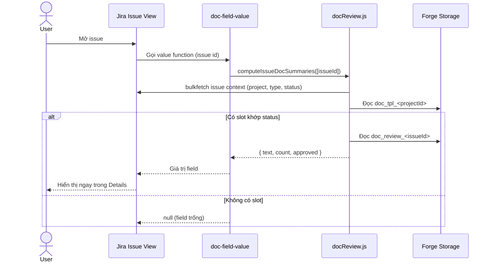
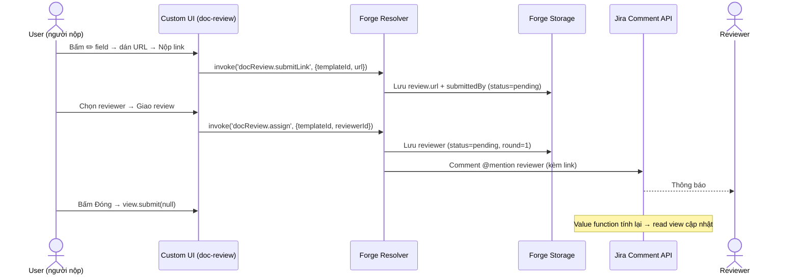

# VietGate — Tính năng "Document Review Gate"
## README thiết kế & triển khai (1 file duy nhất cho người + AI agent)

> **Đối tượng đọc:** lập trình viên và AI coding agent (Claude / Codex).
> **Mục đích:** vừa là *tài liệu thiết kế*, vừa là *spec triển khai* cho tính năng **admin khai báo tài liệu cần nộp theo Issue Type + Status → user nộp link → giao reviewer → 4 trạng thái phê duyệt → mention → gate chặn chuyển status nếu tài liệu bắt buộc chưa duyệt** trên app VietGate hiện có.
> **Cam kết quan trọng:** tính năng này là **cộng thêm (additive)** — **logic DOR/DOD giữ nguyên 100%** (xem §1).
> **Phiên bản triển khai hiện tại:** `4.28.0` (production).

---

## Mục lục

1. ⛔ Nguyên tắc bất biến — KHÔNG được thay đổi
2. Bối cảnh: app VietGate hiện tại
3. Tổng quan tính năng mới
4. Lựa chọn kiến trúc (và lý do)
5. Kiến trúc & vị trí file
6. Mô hình dữ liệu
7. Máy trạng thái & phân quyền
8. Luồng hoạt động (sequence diagrams)
9. Đặc tả Resolver (backend)
10. Document Review Gate (workflow validator)
11. Đặc tả comment + mention (ADF)
12. Đặc tả Frontend (Custom UI) + mockup
13. Custom Field — hiển thị luôn-thấy
14. Thay đổi `manifest.yml`
15. Thay đổi `src/index.js` & `package.json`
16. Tiêu chí nghiệm thu (test checklist)
17. Deploy & kiểm thử (Forge CLI)
18. Tối ưu performance
19. Ràng buộc Forge cần nhớ
20. Tài liệu Forge tham chiếu
21. Phạm vi & hướng mở rộng

---

## 1. ⛔ NGUYÊN TẮC BẤT BIẾN — KHÔNG ĐƯỢC THAY ĐỔI

Logic DOR/DOD và toàn bộ luồng hiện tại phải **giữ nguyên hành vi**. Tính năng mới chỉ **thêm module độc lập** (custom field + workflow validator riêng + resolver riêng + storage key riêng).

### 1.1 File KHÔNG được sửa hành vi

| File | Vai trò (giữ nguyên) |
|---|---|
| `src/engine.js` | Logic checklist DOR/DOD, normalize config, tính progress |
| `src/description.js` | Bơm/parse task-list ADF trong Description |
| `src/workflow.js` | Workflow validator chặn transition (checklist DOR/DOD) |
| `src/gateLeaveCheck.js` | Đánh giá vi phạm khi rời gate status (checklist) |
| `src/gateVisibility.js` | Lọc hiển thị gate theo status |
| `src/completionComment.js` | Comment báo cáo hoàn thành |
| `src/transitionWarning.js` | Comment cảnh báo rời gate |
| `src/triggers.js` | Trigger issue created/updated |
| `src/instance.js` | Dựng instance runtime |
| `src/metadata.js`, `src/projectMeta.js` | Metadata project / issue type / status |
| `src/uimRegistry.js`, `src/checklistPreview.js` | Đăng ký UIM + preview checklist |
| `static/uim/**` | Injector Description |

### 1.2 Manifest — module KHÔNG được đụng

Giữ nguyên: `jira:uiModifications`, `jira:projectSettingsPage`, workflow validator **checklist** (`compliance-gate-validator`), cả 2 `trigger`, và các `function` checklist hiện có. Tính năng Document Review **chỉ THÊM**:
- `jira:customFieldType` (`vietgate-doc-review`)
- `jira:workflowValidator` (`doc-review-gate-validator`)
- `function`: `doc-field-value` (→ `docField.value`) và `validate-doc-gate` (→ `docWorkflow.validator`)
- `resource`: `doc-review-ui`

### 1.3 File dùng chung — chỉ THÊM, không sửa

- `src/index.js`: chỉ thêm 1 import + 1 lời gọi `registerDocReviewResolvers(resolver)`. Không sửa/xoá `resolver.define(...)` sẵn có.
- `static/admin/src/App.js`: chỉ **thêm section** "Tài liệu cần nộp theo Status" (không đổi logic DOR/DOD).
- `package.json` (root): **không** thêm `@forge/react` / `react` ở root (tránh xung đột với Custom UI).
- `permissions.scopes`: **không thêm scope mới** (đã đủ).

> ✅ Tiêu chí: một issue đang dùng DOR/DOD phải chạy **y hệt như trước**, chỉ xuất hiện thêm custom field "VietGate Document Review".

---

## 2. Bối cảnh: app VietGate hiện tại

VietGate là Forge App (Jira Cloud) quản lý **checklist DOR/DOD** (Definition of Ready / Definition of Done) như một *Quality Gate*:

| Thành phần | Module Forge | Vai trò |
|---|---|---|
| Cấu hình DOR/DOD | `jira:projectSettingsPage` (Custom UI – React) | Admin định nghĩa checklist theo Issue Type + status |
| Chèn checklist vào Description | `jira:uiModifications` (UIM) | Bơm task-list vào Description khi tạo/xem issue |
| Chặn chuyển status | `jira:workflowValidator` | Chặn transition nếu item bắt buộc chưa tick |
| Tự động hoá | `trigger` (issue created/updated) | Comment cảnh báo / báo cáo hoàn thành |
| Lưu trữ | Forge Storage (`storage:app`) | Lưu config + instance theo project/issue |

**Hạ tầng tái dùng được:** app đã có `@forge/resolver`, scope `read/write:jira-work`, `read:jira-user`, `storage:app`, và pattern đăng comment ADF. → Tính năng mới **không cần thêm scope**.

---

## 3. Tổng quan tính năng mới

> **Đổi mô hình quan trọng (v4.29 dev / 4.28 prod):** Trước đây admin dán sẵn URL tài liệu — **sai logic**, vì link là *sản phẩm user làm ra*, không thể biết trước. Mô hình mới tách 2 lớp: **admin khai báo YÊU CẦU tài liệu (slot)**, còn **user nộp LINK thật trên từng issue**.

### 3.1 Admin cấu hình (Project Settings)

Tại **Project Settings → DOR / DOD Configuration → "Tài liệu cần nộp theo Status"**, admin khai báo các **ô tài liệu (slot)**:

- Mỗi slot gồm **tên tài liệu** (vd: URD, Test Plan, Tài liệu thiết kế API) + cờ **Bắt buộc** — **KHÔNG nhập URL**.
- Mỗi slot gắn với **Issue Type + Status** cụ thể.
- Có thể nhập **nhiều slot cùng lúc** cho cùng Issue Type + Status (lưu 1 lần).

### 3.2 Trên issue

1. Custom field **"VietGate Document Review"** hiển thị **luôn** trong khu vực Details (read view, 0 click).
2. Khi issue ở đúng Issue Type + Status → các slot hiện ra. Slot chưa có link nằm ở nhóm **"📎 Chưa nộp link"**.
3. **User nộp link**: dán URL vào ô → bấm "📎 Nộp link". Người đã nộp có thể **"✏️ Đổi link"** khi chưa duyệt.
4. **Giao reviewer** (chỉ khi đã có link): app đăng comment **@mention** để Jira gửi thông báo.
5. **4 trạng thái**: `pending` → `in_review` → `approved`, hoặc `rejected` (từ chối – cần làm lại).
6. **Chỉ reviewer** đổi được trạng thái; khi **từ chối** phải nhập **lý do** và app mention lại **người giao review**; người giao bấm **"Gửi lại để review"** (vòng rework).
7. **Gate**: slot **Bắt buộc** chặn chuyển status nếu **chưa nộp link** hoặc **chưa được duyệt** (xem §10).

Kết quả: nhìn field là biết tài liệu nào chưa nộp / đang chờ / đã duyệt / bị từ chối, ai chịu trách nhiệm — không cần mở panel ẩn trong Apps.

---

## 4. Lựa chọn kiến trúc (và lý do)

### 4.1 Vì sao KHÔNG dùng issuePanel / issueContext / issueGlance?

| Phương án | Đánh giá |
|---|---|
| `jira:issuePanel` | ❌ Ẩn trong menu Apps; auto-expand qua issue property **không đáng tin**. |
| `jira:issueContext` | ❌ Nằm sidebar phải, dưới Automation; vẫn phải bấm để mở. |
| `jira:issueGlance` | ❌ Chip trên đầu nhưng nội dung trong flyout — vẫn phải bấm. |
| UI Kit `@forge/react` (native) | ❌ Xung đột React với Custom UI admin/uim → crash `useState` null. |

### 4.2 Giải pháp đã chọn: `jira:customFieldType` (object)

| Thành phần | Công nghệ | Vai trò |
|---|---|---|
| **View (read)** | Value function + formatter expression | Hiển thị **luôn** trong Details, **0 click**, không dùng React |
| **Edit (thao tác)** | Custom UI (`static/doc-review/`) | Nộp link, giao reviewer, duyệt, từ chối, mention — bấm ✏️ trên field |
| **Backend** | `src/docReview.js` + `src/docField.js` | Resolver + value function |
| **Gate** | `jira:workflowValidator` + `src/docWorkflow.js` | Chặn transition khi tài liệu bắt buộc chưa duyệt |

**Lý do:** Custom field là cơ chế **duy nhất** trên Forge/Jira cho phép nội dung app **luôn hiển thị** trong issue view mà không cần thao tác mở panel.

> **Giới hạn 1 field:** Forge chỉ cho app khai báo **một** custom field tĩnh trong manifest — **không thể tạo động nhiều field Jira riêng** cho từng tài liệu rồi gán screen khác nhau. Việc "tài liệu xuất hiện ở screen nào để user nhập" được giải quyết bằng cách **admin gắn field `Document Review` vào screen mong muốn** (Project Settings → Screens) — đó là cấu hình Jira gốc, app không cần code thêm. Còn *slot xuất hiện khi nào* thì điều khiển bằng **Status**.

### 4.3 Lưu trữ & mention

- **Forge Key-Value Storage**, gọi qua `.asApp()` ở backend.
- Key `doc_tpl_<projectId>` → **slot** tài liệu theo Issue Type + Status (admin khai báo).
- Key `doc_review_<issueId>` → trạng thái review **và URL user nộp** cho từng slot trên issue.
- **Mention/notify:** comment ADF mention node (Jira tự gửi chuông + email).
- **User search:** đi qua resolver backend `docReview.searchUsers` (`.asApp()`) cho ổn định trong ngữ cảnh custom field edit (frontend `requestJira` hay bị chặn).

---

## 5. Kiến trúc & vị trí file

```
manifest.yml                      (+customFieldType, +workflowValidator doc-review-gate, +2 function, +resource)
package.json                      (root: KHÔNG có @forge/react; build:ui gồm doc-review)
src/
  index.js                        (sửa: +import & +register doc-review resolvers)
  docReview.js                    (resolver + helper + value function + gate logic)
  docField.js                     (handler value function cho custom field)
  docWorkflow.js                  (handler workflow validator — Document Review Gate)
static/
  admin/src/App.js                (sửa: +section "Tài liệu cần nộp theo Status")
  doc-review/                     (Custom UI — edit field)
    package.json
    public/index.html
    src/
      index.js
      App.js                      (UI nộp link / giao reviewer / duyệt / từ chối — accordion)
      styles.css
```

- Resolver dùng chung `engine-resolver` → `index.handler`.
- Custom field `resolver` khai báo ở **cấp module** (không đặt trong `edit`).
- Ngữ cảnh resolver: `req.context.extension.issue.id`, `req.context.accountId`.
- Ngữ cảnh Custom UI edit: `view.getContext()` → `extension.issue`, `extension.type === 'jira:customFieldType'`.

---

## 6. Mô hình dữ liệu

### 6.1 Slot tài liệu (admin) — `doc_tpl_<projectId>`

```jsonc
{
  "templates": [
    {
      "id": "tpl_<timestamp>_<rand>",
      "issueType": "Task",
      "status": "In Progress",
      "title": "Tài liệu thiết kế API",   // BẮT BUỘC có tên
      "required": true,                    // true = chặn chuyển status nếu chưa duyệt
      "url": "https://..."                 // (tuỳ chọn) chỉ tồn tại với DỮ LIỆU CŨ; mô hình mới KHÔNG nhập URL
    }
  ]
}
```

- Admin CRUD qua resolver `docTemplate.list` / `docTemplate.save` / `docTemplate.saveMany` / `docTemplate.delete`.
- `url` chỉ là **fallback tương thích ngược**: slot cũ đã có URL được coi như "đã nộp sẵn", user vẫn ghi đè được.

### 6.2 Trạng thái review + link user nộp (theo issue) — `doc_review_<issueId>`

```jsonc
{
  "reviews": {
    "tpl_<id>": {
      "url": "https://...",            // LINK do USER nộp (nguồn chính)
      "submittedById": "<accountId>",  // người nộp link
      "submittedByName": "Le Van C",
      "submittedAt": "ISO-8601",
      "status": "pending",             // pending | in_review | approved | rejected
      "reviewerId": "<accountId>",
      "reviewerName": "Nguyen Van A",
      "addedById": "<accountId>",      // người giao review (owner)
      "addedByName": "Tran Thi B",
      "rejectReason": "",
      "round": 1,
      "updatedAt": "ISO-8601",
      "history": [
        { "status": "pending", "byId": "...", "byName": "...", "at": "ISO", "reason": "", "note": "Nộp link tài liệu" }
      ]
    }
  }
}
```

> Slot **chưa được nộp** thì **không** có entry (hoặc entry chưa có `url`). URL hiệu lực = `review.url || template.url`.

### 6.3 Giá trị custom field (object) — tính bởi value function

```jsonc
{
  "text": "📋 Review tài liệu   ▰▱▱▱▱  0/2 đã duyệt\n\n📎 Test Plan  •  Chưa nộp link  🔴 bắt buộc\n⏳ Spec API  •  Chờ review · Nguyen Van A",
  "count": 2,
  "approved": 0
}
```

- **CHỈ** trả về `text`, `count`, `approved` (đúng `schema`). Thêm thuộc tính lạ (vd. `items`) → Jira loại bỏ cả giá trị → field rỗng.
- Slot chưa nộp link hiển thị dòng `📎 … • Chưa nộp link` và được đẩy lên đầu.
- Trả về `null` nếu Issue Type + Status hiện tại **không có** slot → field để trống.

### 6.4 Enum trạng thái

| `status` | Nhãn hiển thị | Icon | Ý nghĩa |
|---|---|---|---|
| *(chưa nộp)* | Chưa nộp link | 📎 | Slot tồn tại nhưng user chưa dán URL |
| `pending` | Chờ review | ⏳ | Đã nộp link, vừa giao / vừa gửi lại, chờ reviewer |
| `in_review` | Đang review | 🔍 | Reviewer đang xem |
| `approved` | Đã duyệt | ✅ | Tài liệu hợp lệ |
| `rejected` | Từ chối | ⛔ | Reviewer từ chối kèm lý do; chờ làm lại |

---

## 7. Máy trạng thái & phân quyền (chốt ở BACKEND)



| Hành động | accountId được phép | Điều kiện |
|---|---|---|
| Nộp / đổi link (`submitLink`) | bất kỳ user xem được issue | Người đã nộp (`submittedById`) mới được đổi; không đổi khi đã `approved` |
| Giao / giao lại reviewer (`assign`) | bất kỳ user (owner mới giao lại) | **Phải đã có link**; owner (`addedById`) mới được giao lại |
| `* → in_review` / `approved` / `rejected` (`setStatus`) | `review.reviewerId` | `rejected` cần `reason` không rỗng |
| `rejected → pending` (`resubmit`) | `review.addedById` (owner) | `round += 1` |

> Mọi kiểm tra quyền **bắt buộc trong resolver**. UI chỉ ẩn/hiện nút — không phải lớp bảo vệ.
> Đổi link khi đang `in_review` → tự đưa về `pending` để review lại từ đầu.

---

## 8. Luồng hoạt động

### 8.1 Xem issue — field tự hiện (0 click)



### 8.2 User nộp link → giao reviewer + mention



### 8.3 Từ chối → gửi lại (vòng rework)

Reviewer `setStatus(rejected, reason)` → mention owner; owner `resubmit` → mention reviewer, `round+1`.

---

## 9. Đặc tả Resolver (`src/docReview.js`)

Export `registerDocReviewResolvers(resolver)` — gọi trong `index.js`.

### 9.1 Admin — quản lý slot tài liệu

| Resolver | Payload | Trả về |
|---|---|---|
| `docTemplate.list` | — | `{ templates }` |
| `docTemplate.save` | `{ id?, issueType, status, title, required, url? }` | `{ templates }` |
| `docTemplate.saveMany` | `{ issueType, status, links: [{ title, required, url? }] }` | `{ templates, added }` |
| `docTemplate.delete` | `{ id }` | `{ templates }` |

> `save` / `saveMany` yêu cầu **title** (tên slot). `url` tuỳ chọn, chỉ validate nếu được truyền vào (tương thích dữ liệu cũ).

### 9.2 Edit — nộp link & review theo issue

| Resolver | Payload | Hành vi chính |
|---|---|---|
| `docReview.searchUsers` | `{ query?, maxResults? }` | Tìm/preload user (`.asApp()`); lọc `accountType=atlassian`, active |
| `docReview.panel` | — | Ghép slot (theo status) + review state → `{ items, currentUserId, currentStatus }` |
| `docReview.submitLink` | `{ templateId, url }` | User nộp/đổi link; nếu có reviewer → mention báo link mới |
| `docReview.assign` | `{ templateId, reviewerId }` | Giao reviewer (**cần có link**); comment @mention |
| `docReview.setStatus` | `{ templateId, status, reason? }` | Authz = reviewer; `rejected` cần lý do |
| `docReview.resubmit` | `{ templateId }` | Authz = owner; `round+1`; mention reviewer |

**`item` trả về cho UI** gồm: `templateId, title, url, submitted, required, status, reviewerId/Name, addedById/Name, submittedById/Name, rejectReason, round`.

**Validate (throw `Error` tiếng Việt):**
- URL không `http(s)://` → "Link tài liệu phải bắt đầu bằng http:// hoặc https://"
- Giao review khi chưa có link → "Vui lòng nộp link tài liệu trước khi giao review."
- Thiếu reviewer → "Vui lòng chọn người review."
- Sai quyền → "Chỉ <tên> mới được đổi trạng thái / đổi link..."
- `rejected` không có lý do → "Vui lòng nhập lý do từ chối."

### 9.3 Value function (`src/docField.js`)

| Export | Vai trò |
|---|---|
| `value(payload)` | Handler Forge gọi khi render field; trả mảng giá trị theo `payload.issues` |
| `computeIssueDocSummaries(issueIds)` | Logic batch trong `docReview.js` |
| `computeIssueDocSummary(issueId)` | Wrapper 1 issue |

---

## 10. Document Review Gate (`src/docWorkflow.js`)

Workflow validator độc lập với checklist DOR/DOD. Chặn transition khi issue **rời** một status mà còn slot **Bắt buộc** chưa được duyệt.

| Thành phần | Giá trị |
|---|---|
| Manifest module | `jira:workflowValidator` key `doc-review-gate-validator` |
| Function | `validate-doc-gate` → `docWorkflow.validator` |
| Logic đánh giá | `evaluateDocGateLeave(issueId, projectId, issueTypeName, leavingStatus)` trong `docReview.js` |
| Thông báo | `buildDocGateErrorMessage(blocking, leavingStatus)` |

**Quy tắc chặn:** slot `required === true` tại `(issueType, leavingStatus)` mà trạng thái `!== approved` (bao gồm **chưa nộp link**) → `{ result: false, errorMessage }`.

**Status đang rời** lấy từ `event.transition.from.id` (qua `fetchStatusName`), fallback `issue.fields.status.name`.

**Thiết lập (admin Jira):** vào cấu hình workflow → transition mong muốn → **Validators → Add → "VietGate Document Review Gate"**. Không gắn validator thì gate không kích hoạt (tài liệu vẫn review bình thường nhưng không chặn).

> Lỗi đọc dữ liệu / thiếu context → validator trả `{ result: true }` (fail-open) để **không chặn nhầm** công việc.

---

## 11. Đặc tả comment + mention (ADF)

Mention node **bắt buộc** dùng `accountId`:

```jsonc
{ "type": "mention", "attrs": { "id": "<accountId>", "text": "@Tên" } }
```

- **assign / resubmit / submitLink (khi đã có reviewer)** → mention **reviewer** (kèm link tài liệu user nộp).
- **setStatus = rejected** → mention **owner** + lý do.
- **approved / in_review** → comment thường (không mention).
- Comment lỗi: **log cảnh báo, KHÔNG throw** — lưu trạng thái vẫn thành công.

---

## 12. Đặc tả Frontend (`static/doc-review/`)

### 12.1 Custom UI (KHÔNG dùng UI Kit ở root)

- React 18 + `@forge/bridge` (`invoke`, `view`, `events`).
- **User search:** gõ tên/email → resolver backend `docReview.searchUsers` (preload danh sách khi query rỗng).
- Chạy trong ngữ cảnh **custom field edit** (bấm ✏️).

### 12.2 Hành vi UI (accordion)

- Mount: `invoke('docReview.panel')` → danh sách slot theo status hiện tại.
- Lắng nghe `JIRA_ISSUE_CHANGED` → refresh khi đổi status.
- **Header:** thanh tiến độ + `X/Y đã duyệt · N từ chối · @ Status`.
- **Nhóm (theo thứ tự):** 📎 Chưa nộp link → ⛔ Từ chối → ⏳ Cần xử lý → 🔍 Đang review → ✅ Đã duyệt. Mỗi nhóm có nhãn + số đếm.
- **Mỗi slot = 1 dòng accordion** (chấm màu + tên + tag Bắt buộc + badge trạng thái). Bấm để bung; **chỉ 1 dòng mở** tại một thời điểm → gọn dù nhiều link.
- **Dòng đã bung:**
  - Chưa nộp → ô `LinkInput` để dán URL + nút "📎 Nộp link".
  - Đã nộp → meta (reviewer / người nộp / vòng), lý do từ chối (nếu có), ô đổi link ("✏️ Đổi link"), ô chọn reviewer, hàng nút hành động (Mở tài liệu, Giao review, Đang review, Duyệt, Từ chối, Gửi lại).
- Nút theo quyền: người nộp (đổi link), owner (giao / giao lại / gửi lại), reviewer (đổi status).
- Nút **Đóng** → `view.submit(null)` → Jira tính lại value function.

### 12.3 Mockup read view (custom field — luôn hiện)

```text
┌─ Document Review ──────────────────────────────────────────┐
│ 📋 Review tài liệu   ▰▱▱▱▱  0/2 đã duyệt                   │
│                                                            │
│ 📎 Test Plan  •  Chưa nộp link  🔴 bắt buộc                │
│ ⏳ Spec API  •  Chờ review · Nguyen Van A                  │
└────────────────────────────────────────────────────────────┘
  [✏️]  ← bấm để mở Custom UI edit (nộp link / giao reviewer / duyệt)
```

---

## 13. Custom Field — thiết lập một lần (admin Jira)

Sau deploy + upgrade install, Jira admin cần:

1. **Settings → Issues → Custom fields → Create custom field**
2. Chọn type **VietGate Document Review** → đặt tên → **Create**
3. Gắn field vào **screens** của project (Issue Type cần dùng — cả Create/Edit/View nếu muốn user nộp link ở nhiều màn hình)
4. Kéo field lên **vị trí cao** trong screen layout (gần đầu Details) nếu muốn nổi bật

> Không có bước này, field type tồn tại nhưng **không hiện** trên issue.

---

## 14. Thay đổi `manifest.yml` (CHỈ THÊM)

```yaml
  jira:customFieldType:
    - key: vietgate-doc-review
      name: VietGate Document Review
      description: Hiển thị các tài liệu cần review theo Issue Type + Status, kèm trạng thái duyệt.
      type: object
      icon: https://developer.atlassian.com/platform/forge/images/icons/issue-panel-icon.svg
      resolver:
        function: engine-resolver
      view:
        value:
          function: doc-field-value
        formatter:
          expression: "value == null ? '—' : (value.text == null ? '—' : value.text)"
      edit:
        resource: doc-review-ui
        experience:
          - issue-view
      schema:
        properties:
          text: { type: string }
          count: { type: number }
          approved: { type: number }

  jira:workflowValidator:
    # ... giữ nguyên compliance-gate-validator (checklist) ...
    - key: doc-review-gate-validator
      name: VietGate Document Review Gate
      description: Chặn transition khi rời status mà còn tài liệu BẮT BUỘC chưa được duyệt.
      function: validate-doc-gate
      projectTypes: ['company-managed', 'team-managed']

  function:
    - key: doc-field-value
      handler: docField.value
    - key: validate-doc-gate          # tên ≤ 23 ký tự (Forge giới hạn)
      handler: docWorkflow.validator

resources:
  - key: doc-review-ui
    path: static/doc-review/build
```

**Lưu ý:**
- `resolver` phải ở **cấp `jira:customFieldType`**, không đặt trong `edit`.
- Key function `validate-doc-gate` phải **≤ 23 ký tự**.
- **Permissions:** giữ nguyên — không thêm scope. Sau khi sửa module: `forge lint` + **redeploy + reinstall --upgrade**.

---

## 15. Thay đổi `src/index.js` & `package.json`

### `src/index.js` (THÊM 2 DÒNG)

```js
import { registerDocReviewResolvers } from './docReview';
// ...
registerDocReviewResolvers(resolver);
```

### `package.json` (root)

```json
{
  "scripts": {
    "build:ui": "npm run build --prefix static/admin && npm run build --prefix static/uim && npm run build --prefix static/doc-review",
    "install:ui": "npm install --prefix static/admin && npm install --prefix static/uim && npm install --prefix static/doc-review"
  },
  "dependencies": {
    "@forge/api": "...",
    "@forge/resolver": "..."
  }
}
```

**Không** thêm `@forge/react` / `react` ở root.

### Build Custom UI doc-review

```bash
npm run install:ui    # lần đầu hoặc sau khi đổi dependency
npm run build:ui      # trước mỗi deploy

# Hoặc build riêng doc-review với bundle nhẹ:
cd static/doc-review && GENERATE_SOURCEMAP=false INLINE_RUNTIME_CHUNK=false npx react-scripts build
```

---

## 16. Tiêu chí nghiệm thu (test checklist)

**Hồi quy DOR/DOD (PHẢI PASS):**
- [ ] Checklist vẫn chèn vào Description.
- [ ] Workflow validator checklist vẫn chặn transition khi thiếu item bắt buộc.
- [ ] Comment cảnh báo / hoàn thành vẫn hoạt động.
- [ ] Project Settings DOR/DOD vẫn lưu được + section tài liệu hoạt động.

**Tính năng mới:**
- [ ] Admin thêm **nhiều slot** Task @ In Progress (có/không bắt buộc) trong Project Settings — lưu 1 lần.
- [ ] Custom field đã tạo và gắn screen.
- [ ] Mở issue Task @ In Progress → field **tự hiện** slot, slot chưa nộp ở nhóm "Chưa nộp link".
- [ ] User dán link → nộp → slot chuyển sang "Chờ review".
- [ ] Chưa nộp link thì **không** giao reviewer được (backend chặn).
- [ ] Giao reviewer → comment @mention + notification.
- [ ] Chỉ reviewer đổi được trạng thái; user khác bị backend chặn.
- [ ] Người nộp đổi link được khi chưa duyệt; đang review → tự về pending.
- [ ] Từ chối kèm lý do → owner được mention; "Gửi lại" → `round+1`, mention reviewer.
- [ ] Gắn validator "Document Review Gate" → transition bị chặn khi slot bắt buộc **chưa nộp** hoặc **chưa duyệt**; thông báo ghi rõ.
- [ ] Đổi status issue → field cập nhật (value function).

---

## 17. Deploy & kiểm thử (Forge CLI)

```bash
cd /Users/td390vn/Checklist/Vietgate
npm run build:ui
forge lint
forge deploy --non-interactive -e production
# Thêm/sửa customFieldType hoặc workflowValidator hoặc scope → cần upgrade install:
forge install --non-interactive --upgrade --site <site>.atlassian.net --product jira --environment production
forge logs -e production --since 15m
```

Site hiện tại: `kvmon-dev.atlassian.net` · App ID: `f5be1cbb-5ac2-4f1e-950e-7328302ab175`

> Chỉ đổi **code** (không đổi manifest) khi tunnelling → hot reload, không cần redeploy. Đổi **manifest** → redeploy (+reinstall nếu đổi module/scope).

---

## 18. Tối ưu performance

Value function chạy **mỗi lần xem issue** — đã tối ưu:

| Kỹ thuật | Lợi ích |
|---|---|
| **`bulkfetch`** REST API | 1 request lấy context nhiều issue (chunk 100), thay vì N request |
| **Cache template theo project** | Đọc `doc_tpl_*` 1 lần/project trong mỗi batch |
| **Bỏ qua đọc review** | Issue không có slot khớp status → **không** đọc `doc_review_*` |
| **Custom UI build** | `GENERATE_SOURCEMAP=false`, `INLINE_RUNTIME_CHUNK=false` → bundle nhẹ hơn |

Read view dùng **formatter expression** (Jira native) — không tải React → hiển thị nhanh nhất có thể.

---

## 19. Ràng buộc Forge cần nhớ

- App chỉ có **một** custom field tĩnh — không tạo động nhiều field; "screen nào" do admin gắn field qua Jira.
- Custom field **view** không hỗ trợ Custom UI — chỉ UI Kit hoặc **formatter/value function**. Ta chọn value function + formatter để tránh xung đột React.
- Value function **chỉ** được trả thuộc tính khai báo trong `schema` (`text/count/approved`); thuộc tính lạ → mất cả giá trị.
- Custom field **edit** hỗ trợ Custom UI — dùng `static/doc-review/`.
- `resolver` của `jira:customFieldType` khai báo ở **cấp module**.
- Key `function` của workflow validator **≤ 23 ký tự**.
- Storage KV chỉ gọi backend `.asApp()`.
- Không thêm scope ngoài manifest hiện có.
- `forge lint` sau mỗi lần sửa manifest.

---

## 20. Tài liệu Forge tham chiếu

- [Jira custom field type](https://developer.atlassian.com/platform/forge/manifest-reference/modules/jira-custom-field-type/) — value function, formatter, edit Custom UI
- [Jira workflow validator](https://developer.atlassian.com/platform/forge/manifest-reference/modules/jira-workflow-validator/)
- [Issue bulkfetch API](https://developer.atlassian.com/cloud/jira/platform/rest/v3/api-group-issues/#api-rest-api-3-issue-bulkfetch-post)
- [User search API](https://developer.atlassian.com/cloud/jira/platform/rest/v3/api-group-user-search/)
- ADF mention node — `{ type: 'mention', attrs: { id, text } }`
- Issue comment REST v3 — `POST /rest/api/3/issue/{id}/comment`

---

## 21. Phạm vi & hướng mở rộng

**Trong phạm vi:** admin khai báo slot tài liệu (tên + bắt buộc) theo status, user nộp link trên issue, hiển thị luôn qua custom field, giao reviewer, 4 trạng thái + "chưa nộp link", mention, vòng rework, gate chặn transition.

**Ngoài phạm vi (tương lai):**
- Tự tạo custom field + gắn screen qua API khi admin bật VietGate (bỏ bước thủ công).
- Đa reviewer / phê duyệt nhiều cấp.
- Đính kèm file trực tiếp (thay vì link).
- Nhắc nhở tự động khi slot bắt buộc quá hạn chưa nộp.

> **Lặp lại nguyên tắc số 1:** không chạm vào logic DOR/DOD. Khi có điểm chưa rõ về nghiệp vụ → hỏi lại người dùng trước khi tự quyết.
