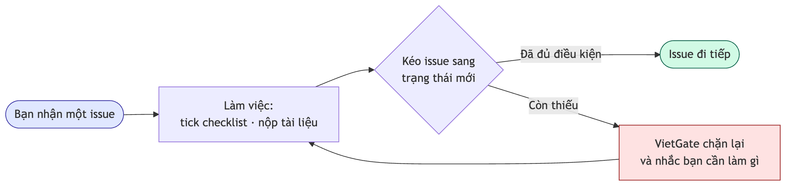
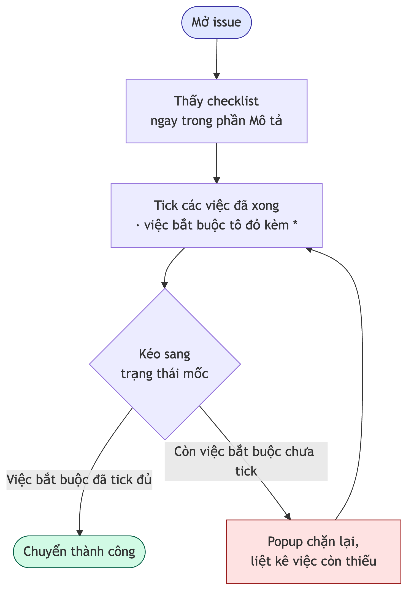
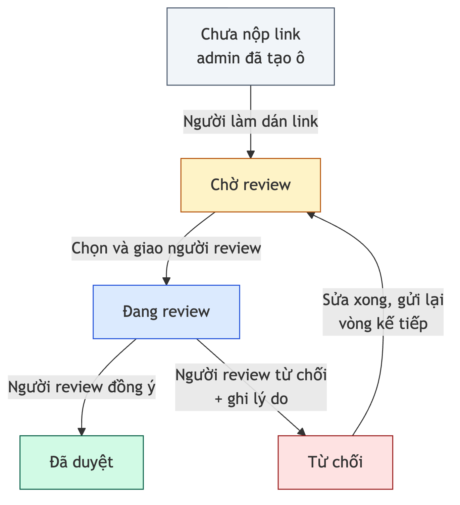
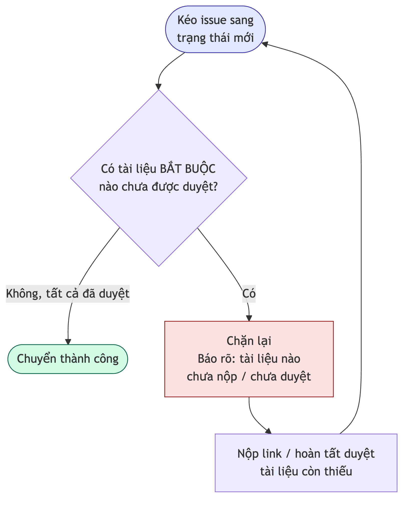
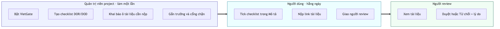

# VietGate — Quality Gate cho Jira Cloud

VietGate là một **Forge App** chạy trên Jira Cloud, giúp đội ngũ kiểm soát chất lượng công việc theo hai cơ chế bổ trợ nhau:

1. **Checklist DOR/DOD** — định nghĩa "Điều kiện sẵn sàng" (Definition of Ready) và "Điều kiện hoàn thành" (Definition of Done) cho từng loại issue, tự chèn vào mô tả issue và chặn chuyển trạng thái khi chưa đạt.
2. **Document Review** — quản lý các tài liệu cần nộp & duyệt theo trạng thái, giao người review, theo dõi phê duyệt và chặn chuyển trạng thái khi tài liệu bắt buộc chưa được duyệt.

Tài liệu này mô tả **chi tiết từng tính năng**: nó làm gì, ai dùng, hành vi ra sao trong từng tình huống. Phần kỹ thuật (file, storage, manifest…) nằm ở **Phụ lục** cuối trang dành cho lập trình viên.

> **Phiên bản production hiện tại:** `4.29.0`

---

## Mục lục

- [A. Bức tranh tổng thể](#a-bức-tranh-tổng-thể)
- [B. Tính năng — Checklist DOR/DOD](#b-tính-năng--checklist-dordod)
- [C. Tính năng — Tự chèn checklist vào mô tả issue](#c-tính-năng--tự-chèn-checklist-vào-mô-tả-issue)
- [D. Tính năng — Cổng chặn chuyển trạng thái (Checklist Gate)](#d-tính-năng--cổng-chặn-chuyển-trạng-thái-checklist-gate)
- [E. Tính năng — Comment tự động](#e-tính-năng--comment-tự-động)
- [F. Tính năng — Document Review](#f-tính-năng--document-review)
- [G. Tính năng — Document Review Gate](#g-tính-năng--document-review-gate)
- [H. Tính năng — Bảo mật & phân quyền](#h-tính-năng--bảo-mật--phân-quyền)
- [I. Hướng dẫn cài đặt & sử dụng](#i-hướng-dẫn-cài-đặt--sử-dụng)
- [J. Vận hành & triển khai](#j-vận-hành--triển-khai)
- [Phụ lục kỹ thuật](#phụ-lục-kỹ-thuật)

---

## A. Bức tranh tổng thể

VietGate hoạt động như một **người gác cổng chất lượng** cho luồng làm việc trong Jira. Thay vì để issue trôi qua các trạng thái mà không kiểm soát, VietGate đảm bảo:

- Mỗi loại issue có **danh sách điều kiện rõ ràng** phải hoàn thành trước khi chuyển trạng thái.
- Tài liệu liên quan (đặc tả, test plan, thiết kế…) được **nộp, giao đúng người review và phê duyệt** trước khi công việc đi tiếp.
- Mọi thao tác quan trọng đều để lại **dấu vết** (comment, mention, lịch sử) để cả đội cùng nắm.

Toàn bộ cấu hình nằm ở cấp **project**, do **quản trị viên project** thiết lập một lần; người dùng thường chỉ tương tác ngay trên màn hình issue.

Hai nhóm tính năng (Checklist và Document Review) **độc lập nhau** — có thể bật/dùng riêng từng cái, không ràng buộc lẫn nhau.

### Hình dung nhanh: VietGate đứng ở đâu trong công việc của bạn?



> Nói đơn giản: **làm đủ thì đi tiếp, thiếu thì VietGate giữ lại và chỉ rõ còn thiếu gì.**

---

## B. Tính năng — Checklist DOR/DOD

### Mục đích
Cho phép quản trị viên định nghĩa **danh sách kiểm tra** cho mỗi loại issue, gắn với một mốc trạng thái cụ thể, để đảm bảo công việc đạt chuẩn trước khi tiến tới.

### Cách cấu hình
Vào **Project Settings → DOR / DOD Configuration**. Với mỗi cấu hình, quản trị viên chọn:

- **Issue Type** áp dụng (vd: Task, Story, Bug).
- **Chế độ cổng (gate mode):**
  - **DOR** — chỉ kiểm soát điều kiện sẵn sàng.
  - **DOD** — chỉ kiểm soát điều kiện hoàn thành.
  - **Cả hai (both)** — kiểm soát đồng thời DOR và DOD.
- **Mốc trạng thái chặn (block on transition to):** chọn trạng thái mà tại đó checklist phải hoàn thành. Mặc định DOR gắn với `In Progress`, DOD gắn với `Done`, nhưng có thể đổi tuỳ workflow.
- **Danh sách item:** từng dòng việc cần kiểm tra. Mỗi item có thể đánh dấu **Bắt buộc (Required)** hoặc để tuỳ chọn.

### Hành vi đáng chú ý
- **Nhiều cấu hình cho một Issue Type:** một loại issue có thể có nhiều cấu hình gắn với các mốc trạng thái khác nhau (vd: một bộ điều kiện khi vào `In Progress`, một bộ khác khi vào `Done`).
- **Ràng buộc trùng status:** hệ thống **không cho** hai cấu hình của cùng Issue Type cùng chặn một trạng thái, và trong một cấu hình thì DOR và DOD không được dùng chung một status — tránh xung đột. Nếu vi phạm, app báo lỗi rõ ràng khi lưu.
- **Chỉ item Bắt buộc mới chặn:** item tuỳ chọn hiển thị để nhắc nhở nhưng không cản trở chuyển trạng thái. Tiến độ (%) được tính trên các item bắt buộc.
- **Yêu cầu tối thiểu:** phải có ít nhất một item trong DOR hoặc DOD mới lưu được cấu hình, và project phải được **bật VietGate** trước khi lưu.

---

## C. Tính năng — Tự chèn checklist vào mô tả issue

### Mục đích
Đưa checklist đến tận nơi người dùng làm việc — ngay trong **phần Mô tả (Description)** của issue — thay vì bắt họ tìm ở một panel riêng.

### Hành vi
- Khi tạo hoặc xem issue đúng Issue Type + trạng thái có cấu hình, VietGate **tự bơm một task-list** (danh sách checkbox gốc của Jira) vào Description, dưới các tiêu đề rõ ràng:
  - **"VietGate — Definition of Ready (DOR)"**
  - **"VietGate — Definition of Done (DOD)"**
- **Item bắt buộc được tô đỏ kèm dấu `*`**, và có dòng chú thích _"Lưu ý: Item màu đỏ (có dấu *) là bắt buộc."_ để người dùng phân biệt ngay.
- Người dùng **tick trực tiếp** vào checkbox trong Description như task-list bình thường của Jira — không cần học giao diện mới.
- App nhận diện phần checklist của mình một cách an toàn (không đụng nội dung khác trong Description) nên người dùng vẫn tự do viết mô tả phía trên/dưới.

---

## D. Tính năng — Cổng chặn chuyển trạng thái (Checklist Gate)

### Mục đích
Biến checklist từ "lời nhắc" thành "luật" — **chặn** việc kéo issue sang trạng thái mới nếu các điều kiện bắt buộc chưa xong.

### Hành vi
- Quản trị viên gắn **validator "VietGate DOR/DOD Checklist"** vào transition mong muốn trong cấu hình workflow của Jira.
- Khi người dùng cố chuyển issue tới mốc trạng thái được cấu hình, VietGate kiểm tra các item **bắt buộc**:
  - Nếu còn item chưa tick → **chặn transition** và hiện popup liệt kê các điều kiện còn thiếu, nhắc người dùng quay lại tick trong Description.
  - Nếu đã đủ → cho phép chuyển bình thường.
- Cổng chỉ kích hoạt ở đúng mốc trạng thái đã khai báo; các transition khác không bị ảnh hưởng.

### Hành trình checklist nhìn từ người dùng



---

## E. Tính năng — Comment tự động

VietGate chủ động để lại comment trên issue ở những thời điểm quan trọng, giúp cả đội theo dõi mà không cần ai phải gõ tay.

### E.1 Cảnh báo rời cổng khi chưa hoàn thành
Nếu một issue **rời khỏi** trạng thái cổng mà điều kiện bắt buộc vẫn chưa xong (ví dụ transition không gắn validator, hoặc bị chuyển bằng cách khác), VietGate đăng một comment cảnh báo nêu rõ những item còn thiếu. Đây là **lớp bảo vệ dự phòng** cho trường hợp validator chưa được gắn. App có cơ chế tránh đăng trùng comment cho cùng một lần chuyển trạng thái.

### E.2 Báo cáo hoàn thành
Khi issue đạt tới trạng thái kết thúc (vd: `Done`, `Closed`, `Resolved`), VietGate có thể tổng hợp tình hình checklist (đã tick bao nhiêu / tổng số item bắt buộc) thành một comment báo cáo, kèm tên người thực hiện — phục vụ truy vết và đối soát.

---

## F. Tính năng — Document Review

> **Triết lý thiết kế:** Link tài liệu là **sản phẩm do người làm việc tạo ra**, không thể biết trước. Vì vậy VietGate tách rõ hai vai: **quản trị viên khai báo "cần nộp tài liệu gì"**, còn **người dùng nộp link thật ngay trên issue**.

### F.1 Quản trị viên khai báo "ô tài liệu" (slot)
Tại **Project Settings → DOR / DOD Configuration → "Tài liệu cần nộp theo Status"**, quản trị viên tạo các **ô tài liệu**:

- Mỗi ô chỉ cần **tên tài liệu** (vd: URD, Test Plan, Tài liệu thiết kế API) — **không nhập URL**.
- Mỗi ô gắn với **Issue Type + Status** cụ thể: chỉ hiện khi issue ở đúng loại và đúng trạng thái đó.
- Có thể đánh dấu ô là **Bắt buộc** (sẽ tham gia chặn chuyển trạng thái — xem mục G).
- Hỗ trợ **thêm nhiều ô cùng lúc** cho cùng một Issue Type + Status và lưu một lần.

### F.2 Trường "Document Review" luôn hiển thị trên issue
VietGate cung cấp một **trường tuỳ biến (custom field)** tên "VietGate Document Review". Khác với panel ẩn trong menu Apps, trường này **luôn hiển thị** trong khu vực thông tin issue mà người dùng **không phải bấm gì** — nhìn vào là thấy ngay:

- Thanh tiến độ tổng quan: _"X/Y đã duyệt"_, số tài liệu bị từ chối, trạng thái hiện tại.
- Danh sách tài liệu, mỗi dòng kèm biểu tượng trạng thái và tên người liên quan.

Để **thao tác** (nộp link, giao review, duyệt…), người dùng bấm nút chỉnh sửa ✏️ trên trường để mở giao diện đầy đủ.

### F.3 Người dùng nộp link tài liệu
- Tài liệu chưa có link nằm trong nhóm **"📎 Chưa nộp link"**.
- Người dùng **dán URL** (bắt buộc bắt đầu bằng `http://` hoặc `https://`) rồi bấm **"📎 Nộp link"**.
- Sau khi nộp, người đã nộp có thể **"✏️ Đổi link"** chừng nào tài liệu chưa được duyệt. Nếu đổi link lúc đang được review, tài liệu tự quay về trạng thái chờ để review lại từ đầu.
- Chỉ **người đã nộp** mới được đổi link của mình.

### F.4 Giao người review & thông báo
- Sau khi có link, người dùng **chọn người review** bằng ô tìm kiếm (gõ tên/email, có gợi ý danh sách).
- Khi giao, VietGate **đăng comment @mention** người review để Jira gửi thông báo (chuông + email) — đảm bảo họ biết việc.
- **Không thể giao review khi chưa có link** — app sẽ nhắc nộp link trước.
- Nếu đã có người review, chỉ **người giao đầu tiên (chủ)** mới được đổi sang người khác.

### F.5 Bốn trạng thái phê duyệt
Mỗi tài liệu đi qua các trạng thái:

| Trạng thái | Ý nghĩa |
|---|---|
| 📎 Chưa nộp link | Ô tài liệu tồn tại nhưng chưa có URL |
| ⏳ Chờ review | Đã nộp link / vừa giao / vừa gửi lại, đang chờ người review |
| 🔍 Đang review | Người review đang xem |
| ✅ Đã duyệt | Tài liệu hợp lệ |
| ⛔ Từ chối | Người review từ chối kèm lý do; cần làm lại |

### F.6 Quy trình duyệt & vòng làm lại (rework)
- **Chỉ người được giao review** mới được đổi trạng thái tài liệu.
- Khi **từ chối**, người review **bắt buộc nhập lý do**; VietGate mention lại **người giao review** kèm lý do để họ biết phải sửa gì.
- Người giao bấm **"Gửi lại để review"** sau khi chỉnh sửa → tài liệu trở lại trạng thái chờ, **đếm vòng tăng lên** (Vòng #2, #3…) và người review được mention lại.
- Mọi bước (nộp, giao, duyệt, từ chối, gửi lại) đều được lưu vào **lịch sử** của tài liệu (giới hạn các mục gần nhất).

### Vòng đời một tài liệu (dễ hình dung)



> Ai làm gì ở mỗi bước:
> - **Người làm việc:** nộp link → giao người review → (nếu bị từ chối) sửa & gửi lại.
> - **Người review:** xem tài liệu → bấm Duyệt hoặc Từ chối (kèm lý do).

### F.7 Giao diện gọn khi nhiều tài liệu
Giao diện chỉnh sửa trình bày theo dạng **accordion**: mỗi tài liệu là một dòng gọn (chấm màu trạng thái + tên + nhãn "Bắt buộc" + badge). Bấm vào dòng mới bung ra chi tiết và các nút thao tác; **chỉ một dòng mở tại một thời điểm** nên dù có nhiều tài liệu, khung vẫn gọn gàng. Các tài liệu được nhóm theo trạng thái: Chưa nộp link → Từ chối → Cần xử lý → Đang review → Đã duyệt.

---

## G. Tính năng — Document Review Gate

### Mục đích
Tương tự Checklist Gate nhưng dành cho tài liệu: **chặn chuyển trạng thái** nếu còn tài liệu **bắt buộc** chưa được duyệt.

### Hành vi
- Quản trị viên gắn **validator "VietGate Document Review Gate"** vào transition mong muốn.
- Khi người dùng rời một trạng thái, VietGate kiểm tra các ô tài liệu **bắt buộc** gắn với trạng thái đó:
  - Còn tài liệu **chưa nộp link** hoặc **chưa được duyệt** → **chặn** và hiện thông báo nêu rõ tài liệu nào còn thiếu (ghi rõ "Chưa nộp link" hay đang ở trạng thái nào).
  - Tất cả đã duyệt → cho phép chuyển.
- **An toàn khi lỗi:** nếu vì lý do nào đó không đọc được dữ liệu, validator **không chặn nhầm** công việc (ưu tiên không cản trở luồng làm việc).
- Cổng chỉ hoạt động khi quản trị viên gắn validator; nếu không gắn, tài liệu vẫn review bình thường nhưng không chặn transition.

### Khi bạn kéo issue sang trạng thái mới



> Tài liệu **tuỳ chọn** (không đánh dấu Bắt buộc) không bao giờ cản trở bạn — chỉ tài liệu **Bắt buộc** mới tham gia chặn cổng.

---

## H. Tính năng — Bảo mật & phân quyền

VietGate thực thi phân quyền ở **tầng backend**, không tin tưởng việc "giao diện chỉ hiện cho admin".

- **Thao tác cấu hình** (tạo/sửa/xoá cấu hình DOR/DOD, khai báo ô tài liệu, bật/tắt VietGate, đọc danh sách issue type/status) đều **yêu cầu quyền quản trị project**. Người gọi phải có quyền *Quản trị project* hoặc *Quản trị site*; nếu không sẽ bị từ chối với thông báo rõ ràng.
- **Thao tác trên issue** (nộp link, giao review, duyệt/từ chối, gửi lại) tuân theo **luật vai trò**: người nộp đổi link của mình, chủ giao/đổi người review, chỉ người review đổi trạng thái, chỉ chủ gửi lại. Mọi kiểm tra này nằm ở backend — giao diện chỉ ẩn/hiện nút cho tiện.
- **Chỉ chấp nhận URL `http(s)://`** ở cả ô nhập link lẫn link trong comment — chặn các scheme nguy hiểm.
- **Không lộ chi tiết lỗi nội bộ** ra người dùng: lỗi gọi API được ghi log phía máy chủ, còn người dùng chỉ thấy thông báo chung, lịch sự.
- **Tối thiểu quyền:** app không yêu cầu thêm phạm vi (scope) ngoài những gì cần thiết.

---

## I. Hướng dẫn cài đặt & sử dụng

### Ai làm gì?



### Dành cho quản trị viên (thiết lập một lần)

1. **Bật VietGate** cho project trong **Project Settings → DOR / DOD Configuration**.
2. **Tạo cấu hình checklist** cho các Issue Type cần kiểm soát (chọn gate mode, mốc trạng thái, thêm item, đánh dấu bắt buộc).
3. **Khai báo ô tài liệu** (nếu dùng Document Review) ở mục "Tài liệu cần nộp theo Status".
4. **Tạo & gắn trường "VietGate Document Review"** vào màn hình (screen) của project:
   - Vào **Settings → Issues → Custom fields → Create custom field**, chọn loại **VietGate Document Review**, đặt tên, tạo.
   - Gắn trường vào các **screen** mong muốn và kéo lên vị trí dễ thấy.
   - *(Lưu ý: app chỉ cung cấp một trường này; việc nó xuất hiện ở màn hình nào do bạn gắn qua cấu hình screen của Jira.)*
5. **Gắn validator vào workflow** (nếu muốn chặn chuyển trạng thái):
   - "VietGate DOR/DOD Checklist" cho cổng checklist.
   - "VietGate Document Review Gate" cho cổng tài liệu.

### Dành cho người dùng (hằng ngày)

- **Checklist:** mở issue → tick các item trong phần Mô tả. Khi chuyển trạng thái, nếu còn thiếu item bắt buộc sẽ bị chặn kèm nhắc nhở.
- **Document Review:** nhìn trường "Document Review" để biết tình hình → bấm ✏️ để nộp link, giao người review, hoặc duyệt/từ chối (tuỳ vai trò của bạn).

---

## J. Vận hành & triển khai

Các lệnh Forge CLI thường dùng (chạy tại thư mục gốc của app):

```bash
# Cài dependency cho các giao diện (lần đầu hoặc khi đổi thư viện)
npm run install:ui

# Build toàn bộ giao diện (admin + uim + doc-review) trước khi deploy
npm run build:ui

# Kiểm tra manifest hợp lệ
forge lint

# Triển khai
forge deploy --non-interactive -e production

# Nếu có thay đổi module/scope/manifest → cập nhật bản cài đặt
forge install --non-interactive --upgrade --site <site>.atlassian.net --product jira --environment production

# Xem log để gỡ lỗi
forge logs -e production --since 15m
```

Khi dùng tunnel để phát triển: chỉ đổi **code** thì hot-reload, không cần deploy lại; đổi **manifest** thì phải deploy lại và khởi động lại tunnel.

---

## Phụ lục kỹ thuật

> Phần này dành cho lập trình viên/agent bảo trì app. Nguyên tắc số 1: **không thay đổi hành vi DOR/DOD hiện có** — Document Review là module cộng thêm độc lập.

### Kiến trúc module (manifest)

| Module | Key | Vai trò |
|---|---|---|
| `jira:projectSettingsPage` | `enterprise-checklist-admin-config` | Trang cấu hình DOR/DOD + ô tài liệu (Custom UI React) |
| `jira:uiModifications` | `vietgate-description-checklists` | Chèn checklist vào Description |
| `jira:workflowValidator` | `compliance-gate-validator` | Cổng chặn theo checklist |
| `jira:workflowValidator` | `doc-review-gate-validator` | Cổng chặn theo tài liệu bắt buộc |
| `jira:customFieldType` | `vietgate-doc-review` | Trường "Document Review" luôn hiển thị + giao diện chỉnh sửa |
| `trigger` | created / updated | Comment cảnh báo / báo cáo hoàn thành |

Trường tuỳ biến dùng **value function** (`docField.value`) để tính giá trị hiển thị mỗi lần xem issue và **formatter expression** để render chuỗi ở read view (không dùng React → luôn hiển thị, nhẹ). Giao diện chỉnh sửa là **Custom UI** (`static/doc-review/`). Lưu ý: value function chỉ được trả các thuộc tính khai báo trong `schema` (`text`, `count`, `approved`).

### Vị trí file chính

```
src/
  index.js          Đăng ký resolver + phân quyền admin các resolver cấu hình
  engine.js         Logic checklist DOR/DOD (chuẩn hoá config, tính tiến độ, gate)
  description.js    Bơm/parse task-list ADF trong Description
  workflow.js       Validator checklist
  gateLeaveCheck.js Đánh giá vi phạm khi rời cổng
  completionComment.js / transitionWarning.js  Comment tự động
  triggers.js       Xử lý sự kiện issue created/updated
  metadata.js / projectMeta.js / instance.js   Metadata & runtime
  uimRegistry.js / checklistPreview.js          Đăng ký UIM + preview
  docReview.js      Resolver Document Review + value function + logic cổng tài liệu
  docField.js       Handler value function cho custom field
  docWorkflow.js    Validator cổng tài liệu
  projectAuth.js    Helper assertProjectAdmin (kiểm tra quyền quản trị project)
static/
  admin/            Giao diện cấu hình DOR/DOD + ô tài liệu
  uim/              Injector Description
  doc-review/       Giao diện chỉnh sửa trường Document Review (accordion)
```

### Lưu trữ (Forge Key-Value Storage, gọi qua `.asApp()` ở backend)

| Key | Nội dung |
|---|---|
| `dor_dod_meta_<projectId>` | Trạng thái bật/tắt + metadata project |
| `dor_dod_config_<projectId>` | Cấu hình checklist theo Issue Type |
| `dor_dod_instance_<issueId>` | Snapshot checklist theo issue |
| `doc_tpl_<projectId>` | Ô tài liệu (slot) theo Issue Type + Status |
| `doc_review_<issueId>` | Link người dùng nộp + trạng thái review từng ô |

### Phân quyền (đã thực thi backend)

- Resolver cấu hình (`docTemplate.*`, `getProjectConfigs`, `setProjectEnabled`, `saveProjectConfig`, `deleteProjectConfig`, `getProjectIssueTypes`, `getProjectStatuses`) gọi `assertProjectAdmin(req)` — kiểm tra `ADMINISTER_PROJECTS` hoặc `ADMINISTER` qua `mypermissions` bằng `.asUser()`.
- Resolver thao tác issue (`docReview.submitLink/assign/setStatus/resubmit`) thực thi luật vai trò người nộp / chủ / người review.

### Quét chất lượng mã (SonarQube)

File `sonar-project.properties` đã giới hạn `sonar.sources` vào mã nguồn thật và loại trừ `build/`, `node_modules/`, `*.min.js`, `*.map`, `.forge/` để tránh nhiễu.

### Ràng buộc Forge cần nhớ

- App chỉ có **một** custom field tĩnh — không tạo động nhiều field; "hiển thị ở screen nào" do admin gắn qua Jira.
- Custom field **view** không hỗ trợ Custom UI → dùng value function + formatter.
- `resolver` của `jira:customFieldType` phải khai báo ở **cấp module** (không đặt trong `edit`).
- Key của `function` workflow validator **≤ 23 ký tự** (vd: `validate-doc-gate`).
- Storage KV chỉ gọi từ backend bằng `.asApp()`.
- Chạy `forge lint` sau mỗi lần sửa manifest.

### Hướng mở rộng (ngoài phạm vi hiện tại)

- Tự tạo custom field + gắn screen qua API khi bật VietGate (bỏ bước thủ công).
- Đa người review / phê duyệt nhiều cấp.
- Đính kèm file trực tiếp thay vì link.
- Nhắc nhở tự động khi tài liệu bắt buộc quá hạn chưa nộp.
